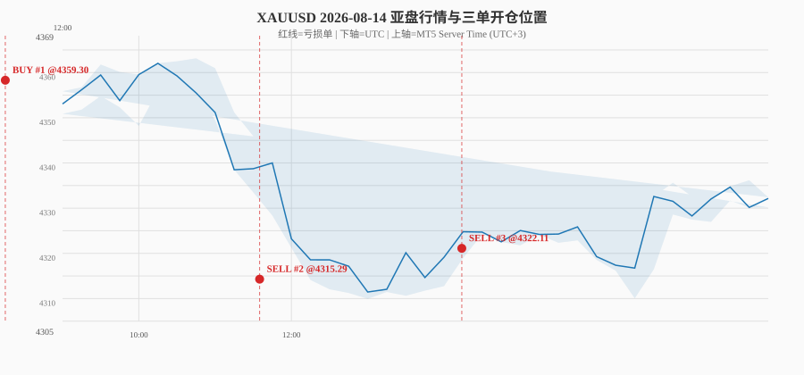

# 8/14 三笔亏损单审计报告：AI 为什么开反方向？

> 审计目标：从 MT5 历史行情还原三单开仓时的真实价格位置，对照 AI 决策快照，判断「方向错误」是数据喂错、执行追单、还是模型判断失误。

---

## 一、三单基本情况

| # | Ticket | 方向 | 开仓价 | 截图时间(MT5) | 平仓价 | 盈亏 | AI 最终决策 |
|---|--------|------|--------|---------------|--------|------|-------------|
| 1 | 383232749/768 | BUY | 4359.38 | 03:15 | 4349.40 | -29.94 | DeepSeek BUY 55% / 混元 BUY 58% / Chronos BUY |
| 2 | 383538133/235 | SELL | 4314.96 | 06:35 | 4327.54 | -12.58 | DeepSeek SELL 68% / 混元 SELL 62% / Chronos SELL |
| 3 | 383644306 | SELL | 4322.11 | 09:14 | 4332.62 | -10.51 | DeepSeek SELL 62% / 混元 HOLD / Chronos SELL |

三单全部亏损，且都是**方向性错误**：
- #1 在阶段性高点（4360 附近）开 BUY，随后跌至 4310；
- #2 在阶段性低点（4315 附近）开 SELL，随后反弹至 4335+；
- #3 在反弹途中（4322）继续 SELL，随后继续上涨。

---

## 二、MT5 行情还原

下图从行情主号 MT5 终端提取 2026-08-14 00:00–12:00 UTC 的 XAUUSD M15 数据，并标注三单开仓位置：

关键观察：

| 单号 | 开仓时的真实行情位置 | 开仓后走势 | 定性 |
|------|---------------------|-----------|------|
| #1 BUY @4359 | 位于 4360–4364 高位区，此前刚从 4364 回落 | 继续下跌至 4310 | **山顶追多** |
| #2 SELL @4315 | 位于 4310–4320 低位区，经历一波急跌后 | 反弹至 4335+ | **山底追空** |
| #3 SELL @4322 | 位于反弹中段 4320–4330 | 继续上涨至 4336+ | **逆势空反弹** |

---

## 三、AI 当时的「想法」

### #1 BUY 单（4359.38）

DeepSeek reasoning：

> 区间震荡下价格回踩M5需求区及M15 FVG，低点抬升+买盘主动，短期反弹概率偏大。Chronos看空但方向中性，此处支撑明确，故优先做多。

**问题**：AI 把「高位回落」识别为「回踩支撑」，未识别出这是趋势末端/流动性扫荡。实际价格从 4360 一路跌到 4310。

### #2 SELL 单（4314.96）

DeepSeek reasoning：

> 短周期M15/M5/H1全面看空，CVD卖压确认，但价格贴近关键低点4310且RSI超卖，不宜追空。待反弹至M15供给区4322-4329做空，止损4343，目标4300。Chronos温和看空支撑方向。

**问题（关键）**：
- AI **自己说**「不宜追空，等待反弹至 4322–4329 再空」；
- 系统实际在 4315 市价追空，比 AI 自己的目标价差了 7–14 美元；
- 原因：`ENTRY_ZONE_DEFER_ENABLED=True`，但 `meta_agent.py` 的「从 reasoning 解析目标价」逻辑在 11:40 才落地，**第二单 11:02 开单时该机制尚未生效**。

### #3 SELL 单（4322.11）

DeepSeek reasoning：

> M5/M15为连续空头结构，CVD卖压主动，H4大阴线跌破近期FVG，短周期动量向下。当前价格处于M1需求区附近，不宜直接追空，等待反弹至M15 bearish FVG（4373.95-4381.17）供给区做空……

**问题**：
- AI 再次表达「不宜追空，等反弹到 4373–4381」；
- 实际在 4322 就开空，远早于 AI 目标区；
- 第三单 13:12 已在新代码运行，但 AI reasoning 里没有给出「可接受的反弹区」结构化价位（只有极远的 4373–4381），`_parse_entry_from_reasoning` 对 4322 这种「当前价附近」无法提取有效目标，所以 ENTRY_ZONE_DEFER 未触发。

---

## 四、根因分析

### 1. 不是「喂错指数」

代码层面已逐项核对：

- `MarketAnalyzer.SYMBOL = "XAUUSD"`（硬编码）；
- Worker `get_market_data` 只取 `XAUUSD` OHLCV；
- `ts_reference_models.load_live_rates` 候选列表也以 `XAUUSD` 为首选；
- 决策快照里的价格与 MT5 终端价格完全匹配。

**结论：喂给 AI 的品种确实是 XAUUSD，不存在把其他指数/品种当黄金喂的情况。**

### 2. 数据时间戳有 bug（不影响实时决策，但严重干扰审计）

- `trades.open_time` 字段存的是**北京时间（UTC+8）**，而 MT5 服务器时间是 **UTC+3**；
- Worker 里 `datetime.fromtimestamp(int(r["time"])).isoformat()` 也用系统本地时区（UTC+8）打标签；
- 后果：数据库时间与真实 MT5 时间对不上，复盘时容易误判；但价格序列本身正确，不影响 AI 实时判断。

### 3. 核心根因：AI 方向判断在亚盘震荡/假突破环境下失效

三单共同特征：
- 都发生在亚盘低流动性时段（MT5 服务器 03:00–09:00）；
- 价格处于区间震荡（4310–4364），假突破/急涨急跌频繁；
- AI 把高位回落看成「回踩支撑做多」，把低位反弹看成「下跌延续做空」；
- Chronos 时序模型有时反向（#1 Chronos 看空但 AI 仍开 BUY），但未被有效制衡。

这是**模型方向识别能力**问题，不是数据问题。

### 4. 执行层追单放大了亏损

- #2、#3 的 AI reasoning 都明确写了「等反弹再空」；
- 但 ENTRY_ZONE_DEFER 机制在 #2 时还未落地，#3 时 AI 没给出结构化目标价；
- 结果：系统用市价在更差价位开仓，把本可避免的亏损实现了。

---

## 五、修复建议

| 优先级 | 问题 | 修复动作 |
|--------|------|----------|
| P0 | 执行层追单 | 已部署的 ENTRY_ZONE_DEFER 在重启后生效；需继续观察 AI reasoning 是否稳定输出目标价。 |
| P0 | 时间戳混乱 | 统一全链路 UTC：Worker 用 `datetime.fromtimestamp(ts, tz=timezone.utc)`；数据库写入前转 UTC。 |
| P1 | 方向判断失效 | 引入「视觉模型看 H4/M15 图表结构」作为第四票（加法，非拦截），增强对假突破/趋势末端的识别。 |
| P1 | Chronos 反向被压制 | 当 Chronos 方向与云端双脑冲突且 confidence 高时，Meta 加权应更谨慎，或触发本地校对员二级确认。 |
| P2 | 亚盘时段质量 | 当前 `session_info` 把 03:00–07:00 标为「凌晨清淡 quality=poor」，但并未据此降低仓位或拦截；可考虑在此时段降低手数系数。 |

---

## 六、结论

**这三单不是「喂错指数」或「数据喂错」导致的。** 喂给 AI 的价格、指标、时间框架都来自 XAUUSD，且与 MT5 终端一致。

真正的病因是：
1. **AI 方向判断在亚盘震荡行情下系统性失效**（模型能力问题）；
2. **执行层没有忠实执行 AI 的价位指引**（ENTRY_ZONE_DEFER 落地时机/解析缺失）。

已经重启加载的新代码（Position Manager + 跟号同步修复 + ENTRY_ZONE_DEFER）会改善「追单」和「错了死扛」问题，但**不会自动解决「AI 方向判断错误」本身**。下一步必须针对方向准确率做专项提升（视觉模型/多模态增强或回测迭代），否则类似的错方向单仍会继续出现。
